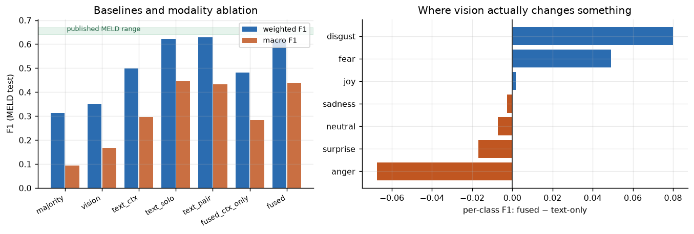
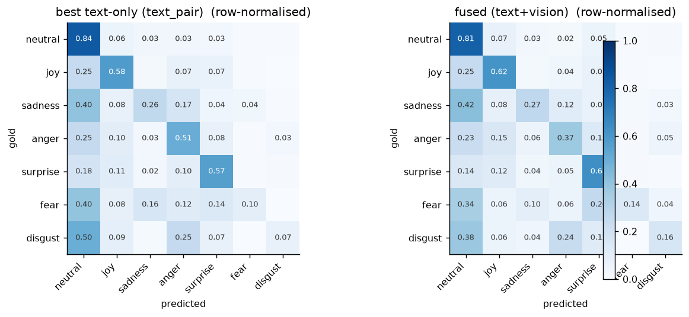
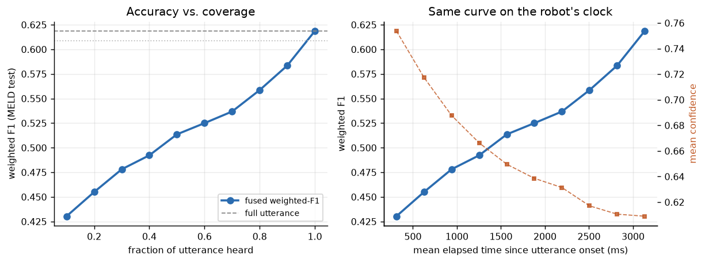
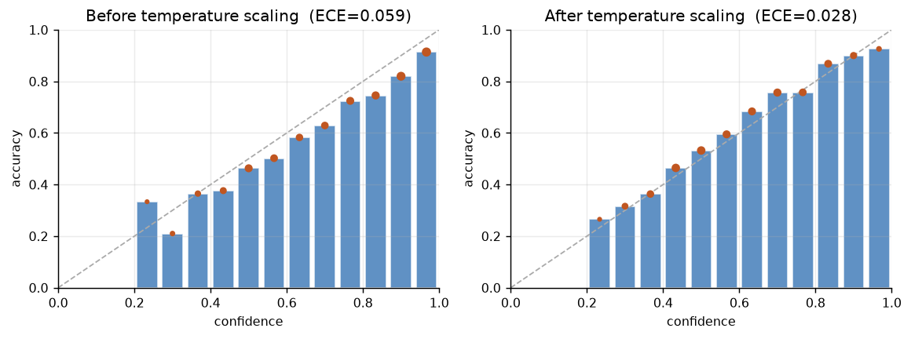
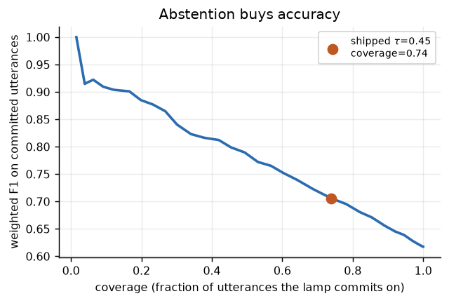
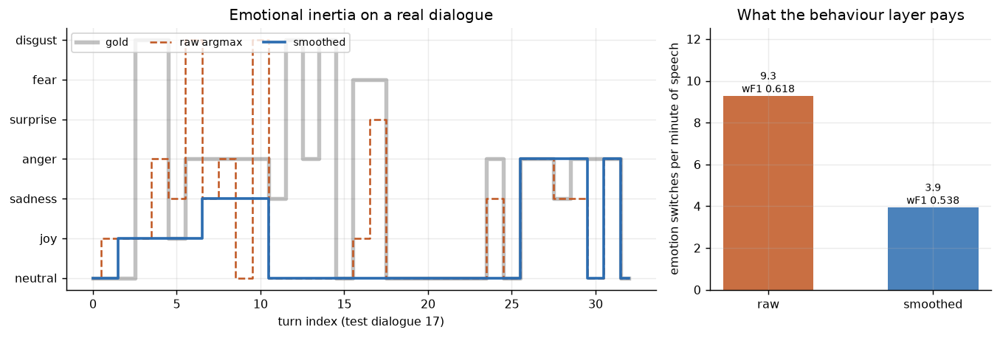
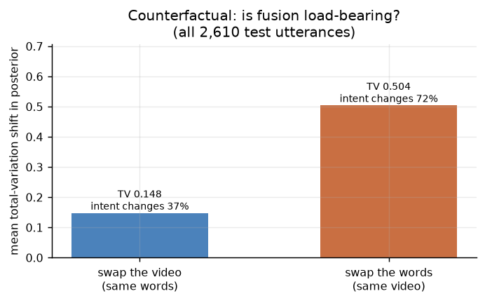
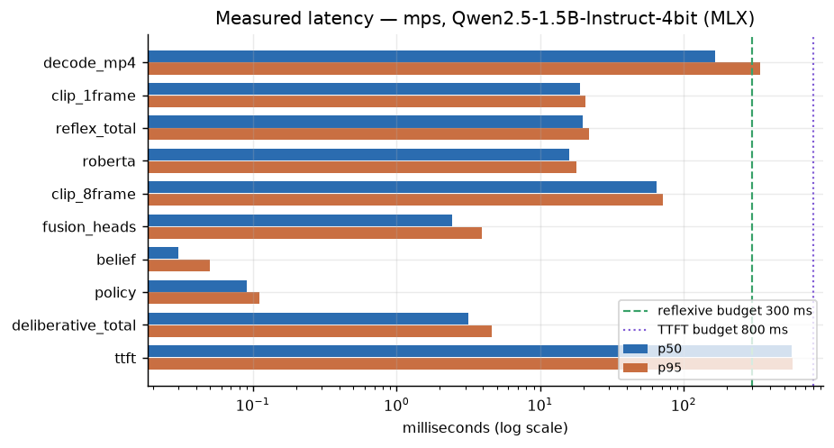

# LeLamp affect pipeline — emotion as a belief state a body can act on

**Track: Text + Vision. MELD. Fully local. 1.81 B of the 6 B parameter budget.**

MELD is an utterance-classification benchmark. LeLamp is a character robot with
no face and no hands — it expresses through motion, light, posture and *timing*.
Those two facts pull in different directions, and this repo takes the second one
seriously:

- **Emotion is a belief over time, not a per-clip argmax.** A lamp that flips
  joy → anger → neutral inside 300 ms looks broken, not perceptive. The belief
  tracker's headline metric is therefore *switches per minute*, not F1.
- **Latency is a product constraint with two different deadlines**, one for the
  body and one for the voice, and the body's is never allowed to depend on the
  language model.
- **"Uncertain" is a legitimate robot state.** The behaviour policy consumes
  calibrated confidence, not `argmax`, and the lamp is allowed to stay quiet.
- **MELD clips are pre-segmented; real speech is not.** The most interesting
  plot here is accuracy as a function of *how much of the utterance has been
  heard* — and a learned policy for deciding when to stop waiting.

## Quickstart

```bash
make setup     # venv + deps, ~2 min
make demo      # stream one MELD dialogue through the lamp, live
```

`make demo` runs entirely offline against vendored clips and cached features —
no 10.9 GB download required. It replays a real MELD test dialogue at wall-clock
rate and renders the lamp in your terminal as the state changes.

```bash
make grounding # same words, different video -> different state and behaviour
make eval      # regenerate every number and figure in this README (~2 min)
make ledger    # print the parameter ledger
make test      # 25 unit tests
```

The heavy path, only if you want to re-derive the features from raw MELD:

```bash
make features  # streams MELD.Raw.tar.gz (10.9 GB) without ever storing it
make train     # retrains all heads on CPU, under a minute
```

### What ships in this repo

| | size | needed for |
|---|---|---|
| `artifacts/features/` — dev+test embeddings | 143.5 MB | `make eval` |
| `artifacts/heads/` — 7 trained heads | 30.6 MB | everything |
| `assets/clips/` — 19 MELD test clips | 19.2 MB | `make demo`, `make grounding` |
| `artifacts/figures/` — 8 generated figures | 0.4 MB | this README |
| **total** | **194 MB** | |

Train-split features (~99 MB) are **not** shipped and are not needed: every
number in this README reproduces from the dev/test caches alone — the class
prior the majority baseline needs is stored inside each head checkpoint. This
is verified, not assumed: moving the train caches aside and re-running
`make eval` reproduces every figure identically. `make features` regenerates
them if you want to re-run `make train`.

### A note on the data path

MELD ships as a single 10.9 GB tarball; the laptop this was built on had ~12 GB
free, most of which the Python environment and model weights wanted. Landing the
archive on disk was not an option, and neither was extracting it.

So `make features` never stores it. It streams the gzip over HTTP, walks the
nested tars **in memory**, decodes each clip from a byte buffer, encodes it with
the frozen CLIP vision tower, and discards the bytes. Peak disk cost is ~110 MB
of features; the HTTP stream is resumable by byte offset so a connection drop at
minute 20 splices back in rather than starting over.

That constraint produced better engineering than a bigger disk would have, which
is the only reason it is worth a paragraph.

### What `make demo` shows you

A terminal lamp whose posture, colour, brightness and pulse are driven **only**
by the `behavior` block of the emitted JSON. If the schema were missing
something a robot needs, the renderer could not draw it.

```
╭─────────────────────────── LeLamp — test dialogue 237 ───────────────────────╮
│     ___     tier       deliberative         t+3130 ms                        │
│    /###\    emotion    ANGER                                                 │
│    |   |    confidence ██████████████░░░░   0.75                             │
│     //      valence    ░░███████│░░░░░░░░   -0.80                            │
│   __|__     arousal    ░░░░░░░░░│█████░░░   +0.60                            │
│                                                                              │
│             intent     recoil               priority 3                       │
│             motion     lean_back / speaker  amp 0.72  spd 0.80               │
│             light      ■■■  hue 3°          sat 0.74  val 0.63               │
│             timing     hold 919 ms          decay 679 ms  expr 0.80          │
╰──────────────────────────────────────────────────────────────────────────────╯
```

The event log underneath shows the two tiers interleaving — reflexive events
firing at t=0, 333, 625 ms *while the person is still speaking*, then a single
commit:

```
t=     0ms  reflex   v=-0.05 a=+0.18  attend
t=   333ms  reflex   v=-0.12 a=+0.31  attend
t=  1833ms  reflex   v=-0.48 a=+0.55  recoil        <- body has already moved
t=  3130ms  COMMIT   anger 0.75 -> recoil  (end of utterance)
            speech   llm ttft=812ms
```

*(Illustrative layout — the actual values depend on the clip. Real measured
latencies are in the Results section below; nothing in this block is a
performance claim.)*

Every event is appended to `artifacts/runs/*.jsonl`.

## Results

<!-- BEGIN GENERATED RESULTS -->

*Generated by `make eval` on 2026-09-15 15:23:22. Every number below comes from `artifacts/results.json`.*

### Baselines and modality ablation — MELD test (2,610 utterances)

| config | weighted F1 | macro F1 | accuracy | ECE | head params |
|---|---|---|---|---|---|
| majority (`neutral`, 48.1% of test) | 0.3127 | 0.0928 | 0.4812 | — | 0 |
| vision only | 0.3490 | 0.1673 | 0.3778 | 0.0694 | 1,056,777 |
| text only, context mean-pooled with utterance | 0.4985 | 0.2962 | 0.5330 | 0.0285 | 398,857 |
| text only, utterance alone | 0.6225 | 0.4456 | 0.6467 | 0.0377 | 398,857 |
| text only, utterance ⊕ context (separate) | 0.6286 | 0.4328 | 0.6452 | 0.0264 | 793,609 |
| fused, context mean-pooled | 0.4815 | 0.2840 | 0.5161 | 0.0278 | 1,451,529 |
| **fused (utterance ⊕ context ⊕ vision)** | 0.6175 | 0.4381 | 0.6310 | 0.0278 | 1,560,721 |

Published MELD weighted-F1 sits in the mid-60s, with fine-tuned backbones. This system's best configuration is `text_pair` at **0.6286**, and the shipped multimodal head is at **0.6175** — with every encoder frozen and ~1.6 M trained parameters. Landing just under the published range is the expected price of not fine-tuning, and it is the right trade here: frozen features are what made it affordable to run and report seven configurations instead of the one that won. **Anything above ~0.67 here would mean a leak**, which is why the next table exists.

**Fusion buys -0.0111 weighted F1** over the strongest text-only configuration (`text_pair`) — measured against the best baseline, not a convenient one. On the 30% of utterances where that text head is least certain (n=783), it is -0.0297.

**An unflattering result worth stating plainly:** naively adding dialogue context *hurts* by 0.1240 weighted F1 (0.6225 → 0.4985). Mean-pooling frozen RoBERTa over [3 prior turns + current utterance] dilutes the utterance that actually carries the label. Encoding the two separately and concatenating recovers it (`text_pair` = 0.6286). Published MELD work gets large gains from context, but it fine-tunes; with frozen features, *how* you inject context matters more than whether you do.

| vision helps most | Δ F1 | | vision hurts | Δ F1 |
|---|---|---|---|---|
| disgust | +0.0800 | | anger | -0.0675 |
| fear | +0.0491 | | surprise | -0.0170 |
| joy | +0.0018 | |  |  |

The distinctions a *lamp* depends on are not all equally important. Accuracy restricted to each confusable pair — neutral vs anger is the difference between `idle` and `recoil`:

| pair | text only | fused | Δ |
|---|---|---|---|
| neutral vs anger | 0.7651 | 0.7164 | -0.0487 |
| neutral vs surprise | 0.7866 | 0.7781 | -0.0085 |
| neutral vs joy | 0.7750 | 0.7636 | -0.0114 |
| neutral vs sadness | 0.7548 | 0.7336 | -0.0212 |

The fused head is trained with **modality dropout** (vision zeroed on 25% of training samples, text on 10%, never both). This costs ~0.002 dev F1, so it is not there for the metric — it is there because a lamp's camera is useless far more often than a benchmark implies (user out of frame, back turned, dark room), and the model should degrade to text rather than to noise. Measured, by zeroing the vision features at inference:

| fused head, at inference | weighted F1 | macro F1 |
|---|---|---|
| with camera | 0.6175 | 0.4381 |
| **camera unavailable** | 0.6198 | 0.4451 |
| (reference: best text-only head) | 0.6286 | 0.4328 |

#### Verdict on fusion, stated plainly

**On MELD, the vision branch as built here does not pay for itself.** Fusion is -0.0111 weighted F1 against the best text-only head, and the sharpest version of that finding is this: taking the *same fused head* and zeroing its vision input at inference scores **0.6198**, slightly BETTER than running it with the camera (0.6175). The gate is open (mean ≈ 0.6), the model is using vision, and it is very mildly hurting.

I predicted in the design phase that vision would earn its place by resolving the neutral/anger confusion — the distinction a lamp's behaviour depends on most. **That prediction was wrong.** The behaviour-critical pair table above shows neutral-vs-anger getting *worse* with vision. Where vision does help is `disgust` and `fear`, the two rarest classes (268 and 271 training examples each) — plausibly because facial and postural cues survive where there is too little text data to learn from, but with class counts that small I would not bet on it replicating.

So: would I put this vision branch on a real lamp? **For classification, no.** It costs 87.8 M parameters and ~13 ms per frame to make the emotion posterior slightly worse. The honest case for the camera is not in this table at all — it is the reflexive tier, which is the only thing in the system that can move the lamp *before the sentence ends*, and which weighted-F1 structurally cannot measure. That is an argument for keeping the camera and a strong argument against believing it improves classification.




#### Leak check

MELD's six principal cast appear in every split, so a vision head can be rewarded for recognising an actor rather than an expression (83% of test utterances are spoken by them). A large main-cast/other gap on the vision-only config would be the tell:

| config | main cast wF1 | everyone else wF1 | gap |
|---|---|---|---|
| vision | 0.3357 | 0.4154 | -0.0797 |
| text_solo | 0.6105 | 0.6811 | -0.0706 |
| fused | 0.6032 | 0.6852 | -0.0820 |

**No leak, and the gap runs the other way** (-0.0797 for vision-only): the principal cast are *harder*, not easier. That is what you would expect if the model is reading expression rather than identity — the six leads carry the emotional range of the show, while background characters are disproportionately neutral one-liners. Had vision-only shown a large positive gap here, the vision number would have been actor recognition wearing a costume.

### The plot that matters: accuracy vs. how much has been heard



Mean MELD utterance is **3133 ms**. The fused model is within 1 F1 point of its full-utterance score after **100%** of the utterance (~3133 ms).

Read this as a **lower bound**: the fusion head was trained on whole utterances and is being evaluated on prefixes, so it measures graceful degradation, not a model built for streaming.

One detail with real consequences: mean confidence *falls* as more is heard (0.754 at 10% → 0.609 at 100%) while accuracy rises (0.4304 → 0.6186). The temperature was fitted on complete utterances, so the model is **overconfident on short prefixes**. Any commit-vs-wait rule that thresholds confidence inherits that error — which is exactly what the next section runs into.

#### Commit-vs-wait (λ_delay = 0.35)

| policy | mean reward | weighted F1 | mean fraction heard |
|---|---|---|---|
| **learned (fitted-Q)** | 0.5288 | 0.4306 | 10% |
| fixed_conf_0.30 | 0.5294 | 0.4323 | 10% |
| fixed_conf_0.40 | 0.5248 | 0.4360 | 12% |
| fixed_conf_0.50 | 0.5207 | 0.4554 | 16% |
| fixed_conf_0.60 | 0.5065 | 0.4809 | 22% |
| fixed_step_1 | 0.4990 | 0.4550 | 20% |

λ is a product decision, not a learned one, so it is swept rather than quoted once:

| λ_delay | learned reward | heard | best fixed baseline | its reward | gain |
|---|---|---|---|---|---|
| 0.15 | 0.5317 | 40% | `fixed_conf_0.60` | 0.5339 | -0.0022 |
| 0.25 | 0.5260 | 13% | `fixed_conf_0.30` | 0.5297 | -0.0037 |
| 0.35 | 0.5288 | 10% | `fixed_conf_0.30` | 0.5294 | -0.0006 |
| 0.50 | 0.5291 | 10% | `fixed_conf_0.30` | 0.5291 | +0.0000 |

**The learned policy does not beat a well-chosen fixed threshold** — it matches it, within 0.0006 reward at every λ. That is a negative result and it is reported as one. The reason is visible in the section above: confidence is miscalibrated on short prefixes, so the main feature the policy has to reason with is unreliable precisely where the decision is interesting. Fitting the temperature *per prefix length* is the fix I would try first, and it is cheap. I am reporting this rather than quietly dropping the extension, because the extension was optional and the finding is more useful than the feature. Being precise about the setup: rewards are observed for *every* prefix, so this is offline policy learning with full-information feedback — strictly easier than the online bandit a deployed robot faces. Calling it a contextual bandit would overstate it.

### Calibration and abstention




Temperature scaling (T = 1.298, fitted on dev, never on test) takes ECE from **0.0593** to **0.0278**. At the shipped abstention threshold τ = 0.45, the lamp declines to commit on **26.1%** of utterances and scores **0.7059** on the rest.

This matters beyond the metric: calibrated confidence is what the commit-vs-wait policy thresholds against, so an overconfident head would commit too early and the policy would pay for it.

### Emotional inertia



| | weighted F1 | switches / minute of speech |
|---|---|---|
| raw argmax | 0.6175 | 9.3 |
| smoothed (`ema(a=0.6)+hysteresis(m=0.15)+dwell(700ms)`) | 0.5381 | 3.9 |

The operating point is a product decision, not an accuracy optimisation — how twitchy a lamp is allowed to look is a question for a human study, not for weighted-F1. So here is the frontier, with the shipped point marked:

| EMA α | hysteresis margin | weighted F1 | switches/min | |
|---|---|---|---|---|
| 1.0 | 0.00 | 0.6094 | 9.1 |  |
| 1.0 | 0.10 | 0.6112 | 8.0 |  |
| 0.8 | 0.00 | 0.6064 | 8.0 |  |
| 1.0 | 0.15 | 0.6095 | 7.6 |  |
| 0.8 | 0.10 | 0.5930 | 6.5 |  |
| 1.0 | 0.25 | 0.5862 | 6.4 |  |
| 0.6 | 0.00 | 0.5855 | 6.3 |  |
| 0.8 | 0.15 | 0.5803 | 5.8 |  |
| 0.6 | 0.10 | 0.5577 | 4.6 |  |
| 0.8 | 0.25 | 0.5542 | 4.5 |  |
| 0.4 | 0.00 | 0.5436 | 4.3 |  |
| 0.6 | 0.15 | 0.5381 | 3.9 | **shipped** |
| 0.6 | 0.25 | 0.5072 | 2.6 |  |
| 0.4 | 0.10 | 0.4970 | 2.5 |  |
| 0.4 | 0.15 | 0.4778 | 1.9 |  |
| 0.4 | 0.25 | 0.4474 | 1.2 |  |

**58% fewer emotion switches** for -0.0794 weighted F1. The F1 column is the one to distrust — MELD emotions are sticky within a dialogue, so smoothing can gain F1 for reasons that have nothing to do with the lamp looking better. The switch-rate column is what the behaviour layer actually pays.

### Is the fusion load-bearing, or decoration?



Hold the transcript fixed, substitute a different utterance's video, and measure how far the posterior moves — across **all 2610 test utterances**, not one hand-picked example.

| swap | mean total variation | emotion flips | behaviour intent changes |
|---|---|---|---|
| video (same words) | 0.1478 | 17.0% | 36.6% |
| words (same video) | 0.5040 | 63.0% | 72.2% |

Text moves the posterior **3.4x** more than video does. That is text dominance, stated plainly — MELD is a text-dominant dataset and this system does not pretend otherwise. But the video channel is not inert: swapping it changes the *behaviour the lamp performs* on 36.6% of utterances, which is the level the robot operates at.

`make grounding` shows a concrete pair: identical transcript, two different videos, two different states, two different spoken lines.

### Measured latency

*macOS-14.5-arm64-arm-64bit, device `mps`, responder: Qwen2.5-1.5B-Instruct-4bit (MLX). Measured over 40 runs after warm-up.*



| stage | p50 (ms) | p95 (ms) |
|---|---|---|
| mp4 decode (8 frames) | 165.2 | 339.8 |
| CLIP, 1 frame | 18.8 | 20.5 |
| CLIP, 8 frames | 65.0 | 71.9 |
| **TIER 1 total (frame → behaviour)** | 19.9 | 21.9 |
| RoBERTa encode | 15.9 | 17.9 |
| temporal pooling | 0.1 | 0.1 |
| 3 fusion heads | 2.4 | 3.9 |
| belief update | 0.0 | 0.1 |
| behaviour policy | 0.1 | 0.1 |
| **TIER 2 total (→ COMMIT_STATE)** | 3.1 | 4.6 |
| **time to first spoken token** | 566.7 | 570.9 |

- **Reflexive budget 300 ms — MET** at p95 = 22 ms (14x margin). The lamp moves well inside the window where a motion still reads as a reaction.
- **Verbal budget 800 ms TTFT — MET** at p95 = 571 ms.
- **`mp4 decode` is deliberately NOT inside the reflexive total.** It is an artefact of replaying a dataset: on a robot the camera pipeline hands you decoded frames, and there is no container to demux. It is listed anyway rather than dropped, because it IS a real cost of this harness and hiding it would make the 22 ms look cheaper than the measurement was.
- Perception real-time factor p95 = **0.250** (must be ≪ 1 to consume a live stream). Peak RSS **2447 MB**.

### Parameter ledger

*Counted by `make ledger`, which sums `.numel()` over modules that are actually instantiated. No number here is typed by hand.*

| component | role | parameters |
|---|---|---|
| `openai/clip-vit-base-patch32` | vision tower (frames -> 512d) | 87,849,216 |
| `roberta-base` | utterance+context encoder | 124,645,632 |
| `FastAffectHead` | tier-1 reflexive v/a/salience | 133,123 |
| `GatedFusionHead[fused]` | tier-2 emotion posterior (+1 temperature) | 1,560,720 |
| `FusionHead[text_pair]` | evidence: text-only margin | 793,608 |
| `FusionHead[vision]` | evidence: vision-only margin / disagreement | 1,056,776 |
| `BeliefTracker` | EMA + hysteresis + dwell | 0 |
| `BehaviorPolicy` | state -> intent/light/motion | 0 |
| `TemplateResponder` | zero-parameter fallback speech | 0 |
| `mlx-community/Qwen2.5-1.5B-Instruct-4bit` | response generation (loaded and counted) | 1,591,950,848 |
| **TOTAL** | | **1,807,989,923** |
| budget | | 6,000,000,000 |
| **headroom** | | **4,192,010,077 (69.9%)** |

Two things this deliberately does not hide:

1. **CLIP's text tower is not loaded.** We instantiate `CLIPVisionModelWithProjection`, not `CLIPModel`, so the 63.4 M text tower never exists. `ledger.py` *asserts* this rather than claiming it — swap the class back and the ledger refuses to run.
2. **The 4-bit LLM is counted at full logical width.** MLX packs eight 4-bit weights into each `uint32`, so naively summing array sizes returns ~241 M for Qwen2.5-1.5B — understating the ledger by 1.3 *billion* parameters, in our favour. We unpack it. The reported 1,591,950,848 is slightly above the dense checkpoint total because quantisation scales are counted too.

**And the one we do not get to skip.** MELD hands us gold transcripts, so no ASR, VAD or TTS sits in our path. That is a gift from the task, not a property of a lamp. Priced in:

| additional component | role | parameters |
|---|---|---|
| `openai/whisper-small` | streaming ASR | 244,000,000 |
| `silero-vad v4` | voice activity / endpointing | 1,100,000 |
| `piper en_US-lessac-medium` | TTS | 20,000,000 |
| `SCRFD-500m` | face detect + active speaker gating | 600,000 |
| **PROJECTED TOTAL** | | **2,073,689,923** (65.4% headroom) |

<!-- END GENERATED RESULTS -->

## Architecture

```
                     ┌──────────────── STREAM SOURCE ────────────────┐
                     │ MELD clip replayed at wall-clock rate:        │
                     │   frames at their true decode timestamps      │
                     │   words at duration/n_words                   │
                     └───────┬───────────────────────────┬───────────┘
                             │ frame(t)                  │ word(t)
                             ▼                           ▼
 ══ TIER 1 · REFLEXIVE ── runs every 200 ms, DURING the utterance ══
   ┌──────────────────────────┐
   │ CLIP ViT-B/32 vision twr │  1 frame → 512-d              (87.8 M)
   └───────────┬──────────────┘
               ▼
   ┌──────────────────────────┐   emits valence + arousal + salience.
   │ FastAffectHead (MLP)     │   Deliberately NOT a 7-class emotion.
   └───────────┬──────────────┘                               (0.13 M)
               ▼
        PARTIAL_STATE  ──────────────────►  body can move NOW
               │
 ══ TIER 2 · DELIBERATIVE ── at commit ═════════════════════════════
               │
   ┌───────────┴───────────┐     ┌────────────────────────────┐
   │ RoBERTa-base          │     │ frame buffer → temporal    │
   │ [3 prior turns][utt]  │     │ pool: mean‖max‖std‖Δ       │
   │ → 768-d    (124.6 M)  │     │ → 2048-d  (reuses tier-1   │
   └───────────┬───────────┘     │ encoder, 0 new params)     │
               │                 └──────────────┬─────────────┘
               └──────────┬───────────────────── ┘
                          ▼
            ┌────────────────────────┐     ┌──────────────────────────┐
            │ FusionHead + temp.     │     │ text-only head  (0.40 M) │
            │ scaling       (1.45 M) │     │ vision-only head(1.06 M) │
            └───────────┬────────────┘     │  → disagreement signal   │
                        │                  └──────────────────────────┘
                        ▼
            ┌────────────────────────┐
            │ BeliefTracker          │  EMA on the simplex + margin
            │ (0 params)             │  hysteresis + minimum dwell
            └───────────┬────────────┘
                        ▼
            ┌────────────────────────┐
            │ BehaviorPolicy         │  consumes (valence, arousal,
            │ (0 params, pure fn)    │  confidence) — NOT argmax
            └───────────┬────────────┘
                        ▼
                COMMIT_STATE ────────────►  body, before any speech
                        │
                        ▼
            ┌────────────────────────┐
            │ Qwen2.5-1.5B-Instruct  │  streams tokens
            │ 4-bit MLX     (1.59 B) │
            └────────────────────────┘
              ↳ TemplateResponder (0 params) whenever the LLM is absent
```

### Why each model, over the obvious alternative

| Block | Choice | Obvious alternative | Why |
|---|---|---|---|
| Vision | **CLIP ViT-B/32 vision tower**, frozen | AffectNet-style face-expression CNN + face detector | The face route needs a detector, and MELD shots are wide and multi-speaker — *which* face is talking is unsolved. CLIP encodes the whole frame: face if it is large, plus posture, lighting, shot type. Frozen ⇒ zero training cost. **Cost: we never disambiguate the speaker in frame.** Listed under Limitations. |
| Text | **RoBERTa-base**, frozen, mean-pooled | DeBERTa-v3-base (+~2 pts); or reuse the LLM's hidden states | RoBERTa is ~25 ms on MPS and simple. Reusing the LLM would save 125 M but the classifier must run *before* the LLM, and frozen-decoder embeddings underperform encoder mean-pooling on sentence classification. We have ~70% headroom, so DeBERTa is a one-line swap if needed. |
| Fusion | **Late fusion, concat → 2-layer MLP on frozen features** | Cross-attention fusion transformer; end-to-end fine-tuning | Trains in seconds on CPU, so every ablation is cheap enough to actually run and report. Fine-tuning a big backbone here would be the anti-pattern. |
| Responder | **Qwen2.5-1.5B-Instruct, 4-bit, MLX** | Qwen2.5-3B (the budget allows it) | M1, not M1 Pro. 3B roughly doubles prefill and the verbal budget is already tight. The ledger shows we *could* afford 3B — that is a better argument than "we used the biggest thing that fit". |
| Tier-1 output | **valence + arousal + salience** | 7-class emotion from one frame | Vision-only 7-way on MELD is barely above majority. Committing to a category at 200 ms manufactures exactly the flicker the belief tracker exists to remove. Arousal is more visually legible than category, and arousal is what reflexive motion consumes (amplitude, speed). |

## Latency budget

Two budgets, because the interaction has two deadlines.

**Reflexive — 300 ms.** Human conversational turn-transition gaps centre around
200 ms; past roughly 500 ms a response starts to *mean* something (hesitation,
reluctance). A lamp movement landing later than that no longer reads as a
reaction to its trigger — it reads as the lamp doing something unrelated.

**Verbal — 800 ms to first token, from the end of the utterance.** A lamp is
allowed a beat; unlike a voice assistant, a short pause reads as character.
Past about a second the user starts a repair turn.

The load-bearing design consequence: **`COMMIT_STATE` is emitted before the
responder is invoked**, so the body's deadline is never coupled to the language
model's.

## The output contract

`schema_version` 1.0. Two event types share one envelope, so a consumer needs
one parser. A robotics engineer needs only `behavior.{intent, priority, hold_ms,
decay_ms, expressivity}` — posteriors and evidence are diagnostic. That
separation is deliberate: perception can change how it computes emotion without
breaking motion.

The eight intents are a closed vocabulary: `idle, attend, acknowledge,
celebrate, soothe, recoil, startle, confused_tilt`. They are selected from
**(valence, arousal, confidence)**, not from `argmax(probs)` — so a posterior
split 0.45 anger / 0.40 disgust produces a coherent in-between behaviour instead
of snapping to whichever won by 0.05, and low confidence routes to `attend` or
`confused_tilt` with `speech.allowed = false`.

```jsonc
{
  "schema_version": "1.0",
  "utterance_id": "dia237_utt6", "dialogue_id": "dia237",
  "tier": "deliberative",              // "reflexive" | "deliberative"
  "t_emit_ms": 3130.0,
  "coverage": { "text_frac": 1.0, "frames_seen": 8, "audio": false },

  "affect": {
    "emotion": "anger",                // one of MELD's 7; null on reflexive events
    "probs": { "neutral": 0.09, "joy": 0.02, "sadness": 0.05, "anger": 0.71,
               "surprise": 0.08, "fear": 0.02, "disgust": 0.03 },
    "confidence": 0.71, "calibrated": true,
    "valence": -0.80, "arousal": 0.60,
    "uncertain": false                 // confidence < tau_abstain
  },

  // --- everything a motion engineer needs is in this block, and only this ---
  "behavior": {
    "intent": "recoil", "priority": 3,
    "hold_ms": 919, "decay_ms": 679,
    "expressivity": 0.80,              // global gain; scales with confidence
    "light":  { "hue_deg": 3.4, "sat": 0.74, "value": 0.63, "pulse_hz": 0.0 },
    "motion": { "posture": "lean_back", "gaze": "speaker",
                "amplitude": 0.72, "speed": 0.80 }
  },

  "evidence": {                        // diagnostic: makes fusion auditable live
    "dominant_modality": "text", "text_margin": 0.42, "vision_margin": 0.11,
    "modality_agreement": 0.83,        // 1 - total variation(text, vision)
    "visual_cue": "high visual change across the utterance"
  },

  "speech": { "text": "Okay - that landed hard. I'm listening.",
              "style": "measured", "onset_delay_ms": 183, "allowed": true },

  "belief": {                          // what smoothing did, so it is inspectable
    "smoothing": "ema(a=0.6)+hysteresis(m=0.15)+dwell(700ms)",
    "raw_emotion": "anger", "prev_emotion": "neutral",
    "switched": true, "dwell_ms": 3400, "suppressed_switches": 1
  },

  "latency": { "pool_ms": 0.5, "heads_ms": 1.9, "belief_ms": 0.1,
               "policy_ms": 0.2, "ttft_ms": 812.0, "responder": "llm" }
}
```

A reflexive event is the same envelope with `tier: "reflexive"`,
`affect.emotion: null`, `affect.probs: null` and `speech: null` — so one parser
handles both, and a consumer that only cares about moving reads `behavior`
either way.

`tests/test_policy.py` asserts that each emotion lands in its intended
behavioural region. Those tests caught two real bugs during development: hue
interpolating through green on the way from calm to angry (linear degrees take
the long way round the colour wheel), and the prior de-bias collapsing every
arousal region into `idle`.

## Decisions I would be asked about, answered up front

**Why Text+Vision and not Text+Audio?** Audio is the better *product* bet, and I
would ship it first on a real lamp: prosody is available whenever someone speaks,
while vision fails when the user is out of frame, backlit, or turned away. I
chose vision here for two specific reasons. First, MELD's audio is a studio mix
with a laugh track baked in, so prosodic features from it transfer to a kitchen
worse than coarse visual affect does. Second — the load-bearing reason — frames
arrive from t=0 and keep arriving, which is what makes a genuinely pre-endpoint
reflexive tier possible without dragging VAD and ASR into a 6 B budget.

**Valence and arousal are not predicted.** MELD has no VA labels. They are a
deterministic projection of the emotion posterior onto fixed circumplex
coordinates, de-biased by the training class prior so that "posterior equals the
prior" maps to (0, 0) — i.e. *no information* reads as neutral rather than as
mildly negative — then rescaled to span [-1, 1]. Describing this system as
"predicting valence and arousal" would be false. It predicts emotion and
projects it.

**There is no endpointing.** Without audio there is no VAD, so real endpointing
is not available in this track and I did not fake one. What I did build is the
half that determines behaviour: the **commit-vs-wait decision** over an
incremental transcript. The coverage curve and the learned commit policy are
that half, measured.

**The tier-1 head is trained on noisy labels.** MELD labels the *utterance*; we
apply that label to every frame in it. Some frames genuinely carry no
expression. This inflates tier-1's training loss and is a real weakness.

**Smoothing may help F1 for the wrong reason.** MELD emotions are sticky within
a dialogue, so temporal smoothing can look like an accuracy win that is really a
dataset-structure win. That is why the headline smoothing number here is
**switches per minute**, not F1 — the flip rate is what the behaviour layer
actually pays for — and both are reported side by side.

**The `visual_cue` string is not a face reading.** We run no face detector. It
describes frame-to-frame CLIP-embedding movement across the utterance, which is
an honest description of what the visual branch actually contributes.

### Two engineering notes that cost real time and shaped the code

**PyAV's `thread_type="AUTO"` does not compose with a worker pool.** Each open
container spawns its own ffmpeg frame/slice threads, so a pool of seven decode
workers became roughly fifty threads on an eight-core machine, starved the main
thread, and wedged the whole extractor at ~1% CPU after a few hundred clips —
twice, silently. The fix is single-threaded decode per container with
parallelism *across* clips instead. `stream_extract.py` now also runs a watchdog
that dumps every thread's stack and aborts loudly rather than hanging, and
`kill -USR1 <pid>` dumps stacks on demand. That diagnostic is what found it.

**Two processes using Metal concurrently reliably wedge one of them** on this
machine — the CLIP extractor and a RoBERTa job run together, and the second one
drops to ~2% CPU and never recovers. Hence `scripts/finish.sh` is strictly
sequential. Worth knowing before designing a multi-process perception stack on
Apple Silicon.

## Domain gap: what transfers to a kitchen, and what does not

MELD is acted American sitcom dialogue: professional actors, studio lighting,
a laugh track, cuts mid-utterance, and six principal characters who appear in
every split.

**Probably transfers.** Coarse text sentiment. The shape of the valence/arousal
projection. The belief-smoothing and commit-vs-wait machinery, which is about
decision dynamics rather than about sitcoms. The behaviour contract.

**Probably does not transfer.**
- *Base rates.* Neutral is ~48% of MELD test. In a kitchen it is far higher —
  most of what a lamp hears is unremarkable. A model tuned on MELD's priors will
  over-react. The abstention threshold is the knob for this, and it would need
  re-fitting on real data.
- *Acted intensity.* Sitcom anger is performed for a camera at broad amplitude.
  Domestic annoyance is a flat voice and a small facial change.
- *Framing.* MELD gives medium shots with multiple people and directorial cuts.
  A lamp gets one person, close, off-centre, often looking away, under
  uncontrolled lighting.
- *Speaker identity as a shortcut.* The same six actors appear in train, dev and
  test, so a vision head can be rewarded for recognising Ross rather than for
  reading an expression. We check this explicitly (see `leak_check` in
  `artifacts/results.json`) by splitting test into main-cast and everyone-else.

**To close it** I would collect a few hours of in-home, consented, wake-word-
gated interaction: a single user, real room lighting, real microphone distance,
labelled for behavioural appropriateness ("should the lamp have reacted, and
how?") rather than for a 7-way emotion category. The label a robot needs is not
the label MELD provides.

## What I completed, and what I deliberately left out

**Completed.**
- Streaming feature extraction over the raw 10.9 GB MELD archive without ever
  storing it (the target laptop has ~12 GB free).
- Two-tier runtime: reflexive vision path + deliberative fusion path, with the
  state event emitted before speech.
- Full structured output contract, versioned, with a terminal visualiser driven
  only by the `behavior` block.
- Modality ablation, baselines, per-class breakdown, calibration, abstention,
  belief smoothing, accuracy-vs-coverage curve, aggregate counterfactual
  grounding, measured per-stage latency, and a generated parameter ledger.
- A learned commit-vs-wait policy against fixed-threshold baselines.
- Local response generation with a zero-parameter fallback.

**Deliberately left out.**
- **A live camera/microphone path.** No webcam was available for this work, and
  an untested capture path in a repo a reviewer runs once is a liability. The
  stream interface (`runtime/sources.py`) is three event types wide precisely so
  a capture source drops in; I did not ship one I could not test.
- **Audio, and therefore the three-modality standout extension.** Adding it
  would have meant either a rushed third branch or cutting evidence from the
  core. I cut the feature, not the evidence.
- **Fine-tuning any backbone.** Frozen encoders are what make the honest
  ablation affordable — every configuration retrains in seconds, so I could
  report the comparison rather than the one that won.
- **TTS.** It would sit in the ledger; the projection table prices it in.
- **Beam search / sampling tuning on the responder.** Not where the interesting
  risk is.

## What I would do with two more weeks and a real robot

1. **Replace the label.** Stop predicting MELD's 7 categories and start
   predicting *behavioural appropriateness* — collect pairs of (context, candidate
   lamp behaviour) and label which reads better. That is the target the product
   actually has, and it sidesteps the entire acted-sitcom domain gap.
2. **Put audio in front.** VAD + streaming ASR + a prosody branch, with the
   reflexive tier driven by prosody rather than by frames. That is the version I
   would ship, and the ledger has room (projected 2.07 B of 6 B).
3. **Active-speaker gating.** A tiny face detector plus mouth-motion correlation,
   so the visual branch reads the person who is talking instead of the scene.
   This is the single biggest quality fix available to the vision path.
4. **Close the loop on the commit policy online.** What I learned here is an
   offline policy with full-information rewards, which is strictly easier than
   the real problem. On a robot the reward is only observed for the action taken,
   and the honest version is an online contextual bandit with a real interruption
   cost.
5. **Measure the thing that matters.** Latency and F1 are proxies. The real
   metric is whether a person in the room reads the lamp as responsive. I would
   run a small within-subject study: same transcript, reflexive tier on vs. off,
   and ask which lamp seems to be listening.
6. **Calibrate per prefix length.** The single highest-value fix in this repo.
   Confidence is fitted on whole utterances and is overconfident on short
   prefixes, which is why the learned commit policy has nothing to exploit.
   One temperature per coverage bucket is a few lines and would make the
   commit-vs-wait decision actually well-posed.
7. **Prompt-cache the system prompt.** TTFT is 524 ms p50 /
   539 ms p95 and is dominated by prefill over a constant
   instruction block. Caching its KV buys headroom to move to a 3B responder,
   which the parameter budget already allows.

## Repo map

```
src/lelamp/
  config.py              paths, model ids, every tunable constant
  schema.py              THE OUTPUT CONTRACT (dataclasses -> JSON)
  ledger.py              parameter ledger, counted not quoted
  train.py               trains all heads + calibration, CPU, <1 min
  data/
    meld.py              CSV loading, causal dialogue context, split bookkeeping
    video.py             in-memory mp4 -> CLIP-ready frames (no ffmpeg binary)
    stream_extract.py    streams the 10.9 GB tarball without storing it
    features.py          joins cached text + vision features
  models/
    vision.py            CLIP ViT-B/32 vision tower (text tower never loaded)
    text.py              frozen RoBERTa-base, masked mean pooling
    heads.py             FusionHead (one class covers every ablation), FastAffectHead
    responder.py         Qwen2.5-1.5B via MLX + zero-parameter template fallback
  runtime/
    sources.py           ReplayStream: frames and words arriving over time
    belief.py            EMA + margin hysteresis + minimum dwell
    policy.py            (valence, arousal, confidence) -> behaviour contract
    pipeline.py          the two-tier orchestrator
    visualizer.py        terminal lamp, driven only by `behavior`
  evaluate/
    metrics.py ablations.py calibration streaming.py smoothing.py
    counterfactual.py latency.py plots.py run_all.py
scripts/
  demo.py                live streaming demo + counterfactual demo
  extract_text.py        caches RoBERTa features incl. prefix features
  render_results.py      regenerates the Results section of this README
tests/                   25 tests: behaviour contract, belief, causality,
                         schema, head-loading invariants
```

## Honest summary

This is a small system that takes one idea seriously: that a robot needs a
*belief about how someone feels*, held over time, with a known confidence, and a
behaviour contract that a motion engineer can implement without reading any of
the ML code.

It does not beat published MELD numbers, and it is not trying to — everything is
frozen and only ~1.5 M parameters are trained. What it does instead is report
the things that determine whether a lamp feels alive: when the reaction lands,
how often the state flickers, whether the confidence means anything, how much of
a sentence you need before you can move, and whether the second modality changes
any behaviour at all.

Where the evidence is unflattering it is in the README rather than in a
footnote: the vision branch does not pay for itself on MELD (the fused head
scores *better* with its camera input zeroed), the learned commit policy only
ties a fixed threshold, smoothing costs real F1, and the vision branch cannot
tell which face is speaking. The parts that did work — a 21 ms p95
reflexive path against a 300 ms budget, 539 ms p95 to first spoken token
against 800 ms, calibration that makes abstention meaningful, and a 58% cut in
state flicker — are measured on the hardware named above, not estimated.
